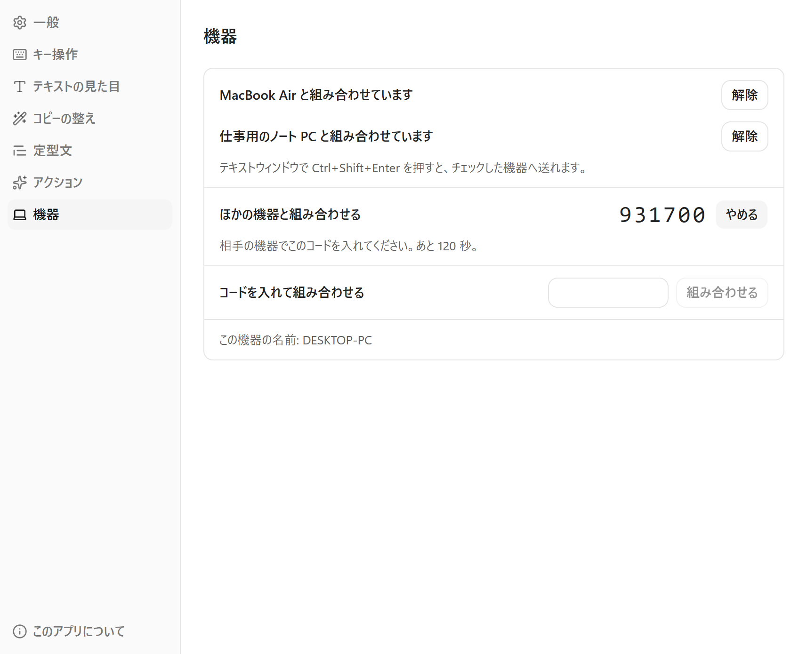
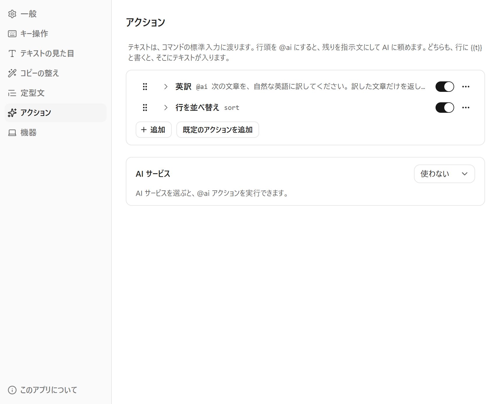
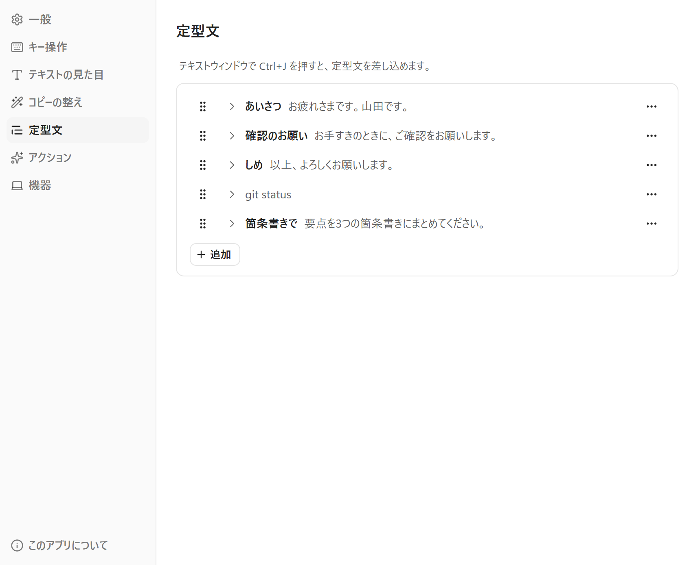
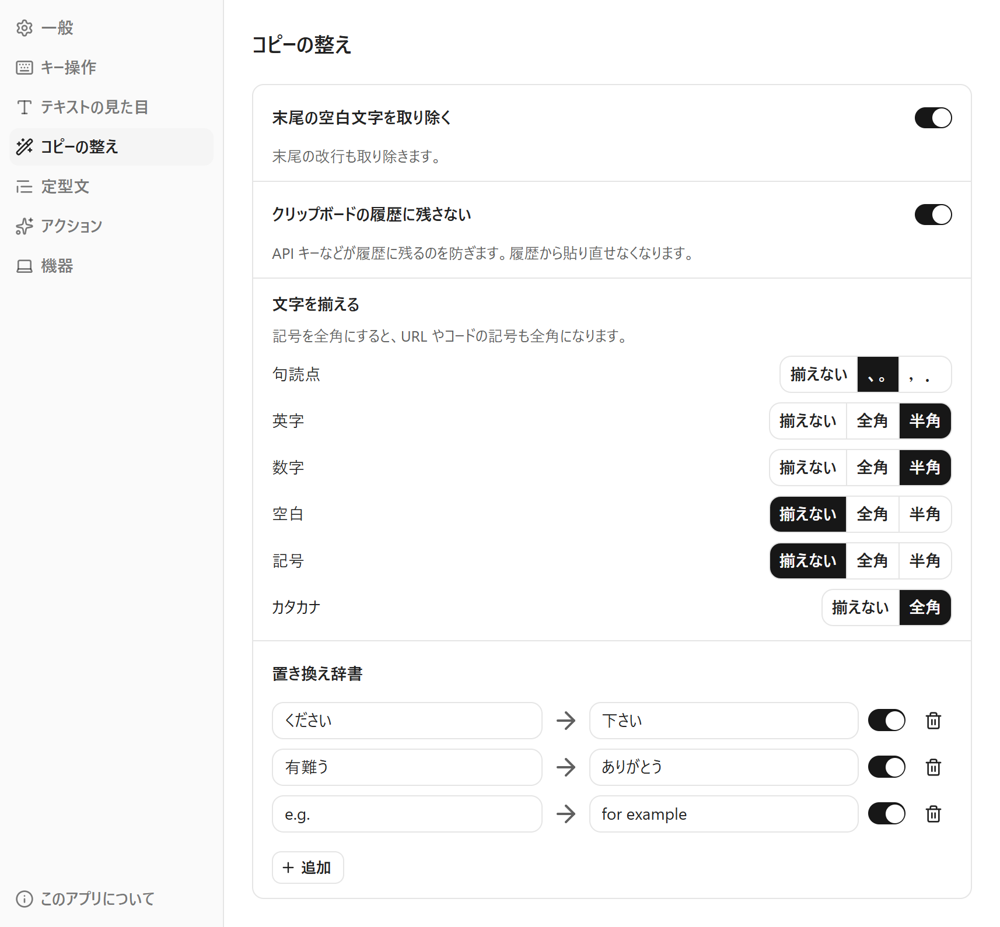

## 主な特徴

- **ひと押しで出る**: ホットキー一つで、どのアプリからでもテキストウィンドウを出せます。
- **貼り付けるのは自分**: コピーすると元のアプリに戻るので、そのまま貼り付けます。
- **ほかの機器へ送る**: 書いたテキストを、自分の Mac や Windows へそのまま送れます。
- **コピーのときに整える**: 語句の置き換えや、句読点・全角と半角の統一を、コピーのたびに自動で通せます。
- **定型文**: よく使う書き出しや指示文を、選ぶだけで差し込めます。
- **アクション**: テキストをコマンドや AI に通して、結果で置き換えられます。
- **書いたものを呼び戻せる**: 前にコピーしたテキストを、キーでたどれます。

## 画面

自分の Mac や Windows とは、6桁のコードで組み合わせます。あとは、書いたテキストをそのまま送れます。

アクションは、設定で登録しておき、テキストウィンドウで選んで使います。最初から、AI に頼む「英訳」と、行を並べ替える「sort」のコマンドが入っています。AI に頼むアクションは、AI サービスに「Mawok」（アカウントのクレジット）か、自分の API キーで使う Gemini・Anthropic・OpenAI を選ぶと使えます。

定型文も、設定で登録しておき、テキストウィンドウで選んで差し込みます。

コピーのたびに通す整えも、設定で選べます。

## 使う流れ

1. ホットキーを押すと、テキストウィンドウが出ます。
2. 書きます。音声入力でも、キーボードでも構いません。
3. コピーのキー（既定は Ctrl+Enter / Cmd+Enter）を押します。
4. 元のアプリに戻っているので、そのまま貼り付けます。

## よくある質問

### 無料ですか？

Mawok は無料で使えます。AI アクションを使うときだけ、利用料がかかります。自分の API キーで使うなら、そのサービスに払います。キーを持っていなければ、Mawok のアカウントのクレジットで使えます。詳しくは[料金](/pricing/)をご覧ください。

### AI は必ず使いますか？

使いません。既定では使わない設定です。使うときは、AI サービスを「Mawok」（アカウントのクレジットで使う）か、自分の API キーで使う Gemini・Anthropic・OpenAI から選びます。

### AI アクションのクレジットとは？

キーを持っていなくても AI アクションを使えるよう、Mawok が Google の Gemini に取り次ぐ分の前払いです。新しいアカウントには、試せる分が少し付きます（月ごとの上限に達したときは、翌月以降に付きます）。期限はありません。買い足しは[料金](/pricing/)から行えます。

### ほかの機器へ送るには？

設定の「機器」で、6桁のコードを使って2台を組み合わせます。同じネットワークの中なら、Mac と Windows の間でも送れます。

### 終了するには？

タスクトレイ（macOS ではメニューバー）のメニューから終了します。macOS では、Cmd+Q では終了しません。

## 動作環境

- **Windows**: Windows 10（64ビット）以上。
- **macOS**: macOS 13（Ventura）以上。Apple シリコンの Mac に限ります。
